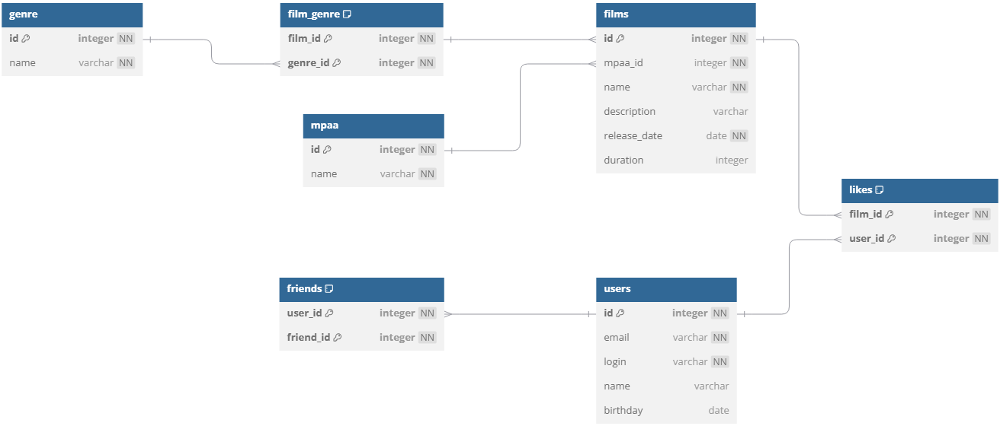

# java-filmorate
Template repository for Filmorate project.

# Диаграмма

# Описание таблиц

## Users

Таблица **users** содержит информацию о пользователях.

| Поле     | Тип     | Не пустой | Ключ  | Ссылка на таблицу | Описание                 |
|----------|---------|-----------|-------|-------------------|--------------------------|
| id       | integer | Да        | PK    |                   | Уникальный идентификатор |
| email    | varchar | Да        |       |                   | Адрес электронной почты  |
| login    | varchar | Да        |       |                   | Логин пользователя       |
| name     | varchar |           |       |                   | Имя пользователя         |
| birthday | date    |           |       |                   | Дата рождения            |

## Friends

Таблица **friends** содержит информацию о друзьях пользователей.

| Поле                     | Тип     | Не пустой | Ключ  | Ссылка на таблицу     | Описание                                      |
|--------------------------|---------|-----------|-------|-----------------------|-----------------------------------------------|
| user_id                  | integer | Да        | PK FK | users                 | Пользователь, ссылка на поле id таблицы users |
| friend_id                | varchar | Да        | PK FK | users                 | Друг, ссылка на поле id таблицы users         |

## Genre

Таблица **genre** содержит информацию о жанрах фильмов.

| Поле | Тип     | Не пустой | Ключ  | Ссылка на таблицу | Описание                 |
|------|---------|-----------|-------|-------------------|--------------------------|
| id   | integer | Да        | PK    |                   | Уникальный идентификатор |
| name | varchar | Да        |       |                   | Наименование жанра       |

## MPAA

Таблица **mpaa** содержит информацию о возрастных рейтингах фильмов.

| Поле | Тип     | Не пустой | Ключ  | Ссылка на таблицу | Описание                 |
|------|---------|-----------|-------|-------------------|--------------------------|
| id   | integer | Да        | PK    |                   | Уникальный идентификатор |
| name | varchar | Да        |       |                   | Наименование рейтинга    |

## Films

Таблица **films** содержит информацию о фильмах.

| Поле         | Тип     | Не пустой | Ключ | Ссылка на таблицу | Описание                                           |
|--------------|---------|-----------|------|-------------------|----------------------------------------------------|
| id           | integer | Да        | PK   |                   | Уникальный идентификатор                           |
| mpaa_id      | integer | Да        | FK   | rating            | Возрастной рейтинг, ссылка на поле id таблицы mpaa |
| name         | varchar | Да        |      |                   | Название фильма                                    |
| description  | varchar |           |      |                   | Описание фильма                                    |
| release_date | date    | Да        |      |                   | Дата выхода                                        |
| duration     | integer |           |      |                   | Длительность фильма в минутах                      |

## Film_genre

Таблица **film_genre** содержит информацию о жанрах присвоенных фильмам.

| Поле     | Тип     | Не пустой | Ключ  | Ссылка на таблицу | Описание                               |
|----------|---------|-----------|-------|-------------------|----------------------------------------|
| film_id  | integer | Да        | PK FK | films             | Фильм, ссылка на поле id таблицы films |
| genre_id | integer | Да        | PK FK | genre             | Жанр, ссылка на поле id таблицы genre  |

## likes

Таблица **likes** содержит информацию о лайках, поставленных пользователями на фильмах.

| Поле    | Тип     | Не пустой | Ключ  | Ссылка на таблицу | Описание                                      |
|---------|---------|-----------|-------|-------------------|-----------------------------------------------|
| film_id | integer | Да        | PK FK |                   | Фильм, ссылка на поле id таблицы films        |
| user_id | integer | Да        | PK FK |                   | Пользователь, ссылка на поле id таблицы users |